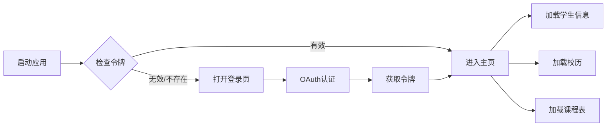

::: note 摘要

OneTJ（一统同济）是一个简洁、专注的同济大学服务第三方客户端，提供学生信息查询、课程表展示、校历浏览等功能。

::: right

2025-01-29 @OneTJ

:::

## 项目概述

**OneTJ** 是一个基于 Flutter 框架开发的跨平台移动应用，专为同济大学学生打造。它提供了简洁、专注的使用体验，支持查询学生信息、课程表、校历等数据，并支持离线访问。

### 项目特点

- **跨平台支持**：支持 Android、iOS、Web、Windows、macOS、Linux、OpenHarmony（鸿蒙）七大平台
- **离线友好**：使用 Hive 本地缓存，支持离线查看已缓存的数据
- **简洁专注**：界面简洁，专注于核心功能，无冗余内容
- **官方认证**：使用同济大学官方 Keycloak OAuth2 认证系统

## 主要功能

### 学生信息

展示完整的学籍信息，包括：

- 学号、姓名、性别
- 学院、专业、班级
- 入学日期、预计毕业日期
- 学制、培养层次
- 学籍状态、政治面貌
- 辅导员、副辅导员信息

### 课程表

- 展示学期课程表
- 显示课程名称、上课时间、教室、授课教师
- 支持按周次查看课程
- 自动索引和排序

### 校历

- 显示当前学期校历
- 展示当前周数
- 显示学期时间范围
- 显示学期总周数

## 技术栈

| 技术 | 说明 |
|------|------|
| **框架** | Flutter 3.6.2+ |
| **语言** | Dart |
| **架构** | MVVM (Model-View-ViewModel) |
| **本地存储** | Hive |
| **网络请求** | HTTP |
| **认证** | OAuth2（同济大学 Keycloak） |
| **路由** | go_router |
| **国际化** | flutter_localizations |
| **代码生成** | json_serializable + build_runner |

## 应用流程

## 项目状态

::: warning 注意事项

- 项目目前处于活跃开发阶段，部分功能可能不稳定
- 暂无正式的 Release 版本发布
- 欢迎提交 Issue 和 Pull Request

:::

## 相关链接

- **GitHub 仓库**：[oierxjn/OneTJ](https://github.com/oierxjn/OneTJ)
- **原始仓库**：[FlowerBlackG/OneTJ](https://github.com/FlowerBlackG/OneTJ)
- **同济大学 API**：api.tongji.edu.cn
