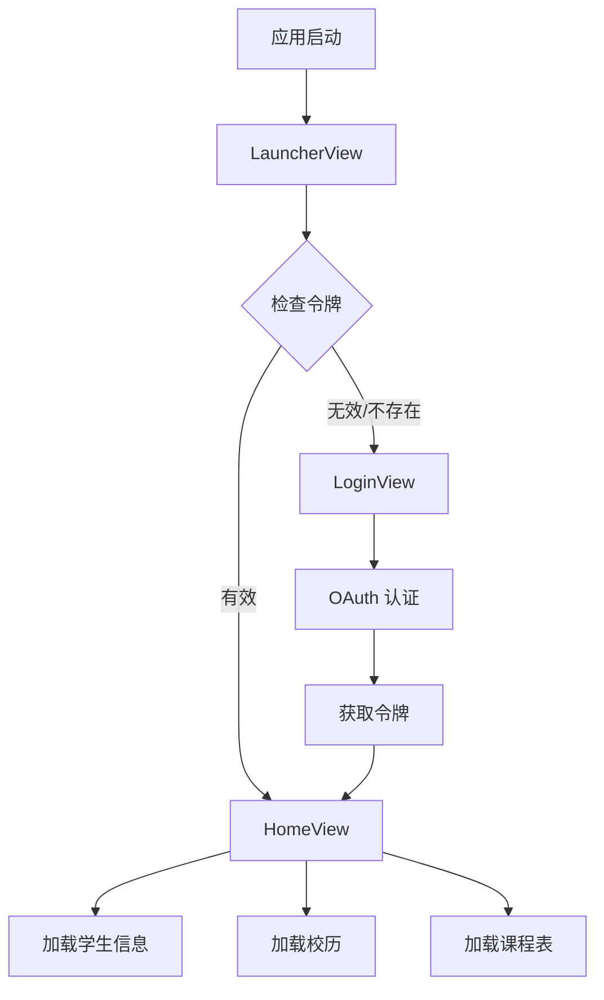

## 应用启动流程

OneTJ 的启动流程采用 **Launcher → Login → Home** 的设计模式。

### 流程图



## Launcher 模块

### 职责

- 初始化本地存储（Hive）
- 检查是否存在有效的 Access Token
- 根据令牌状态决定跳转目标

### 代码流程

```dart
class LauncherViewModel extends BaseViewModel {
  Future<void> checkAuth() async {
    // 1. 初始化 Hive
    await Hive.initFlutter();

    // 2. 获取令牌
    final repo = TokenRepository.getInstance();
    final token = await repo.getToken();

    // 3. 检查令牌有效性
    if (token != null && !token.isAccessTokenExpired()) {
      // 令牌有效，跳转到主页
      _eventController.add(const NavigateEvent(RoutePaths.home));
    } else {
      // 令牌无效，跳转到登录页
      _eventController.add(const NavigateEvent(RoutePaths.login));
    }
  }
}
```

## Login 模块

### 职责

- 展示 WebView 进行 OAuth2 认证
- 捕获重定向 URL 中的授权码
- 交换授权码获取访问令牌
- 保存令牌到本地

### OAuth2 流程

```
用户              LoginView              同济 Keycloak
 │                    │                        │
 │  打开登录页         │                        │
 │───────────────────>│                        │
 │                    │  发起授权请求            │
 │                    │───────────────────────>│
 │                    │                        │
 │                    │  返回授权页面            │
 │                    │<───────────────────────│
 │                    │  展示登录页面            │
 │  输入凭据           │<───────────────────────│
 │───────────────────>│                        │
 │                    │  提交凭据               │
 │                    │───────────────────────>│
 │                    │                        │
 │                    │  重定向到 redirect_uri   │
 │                    │<───────────────────────│
 │  捕获授权码         │                        │
 │                    │  code2token 交换        │
 │                    │───────────────────────>│
 │                    │  返回令牌               │
 │                    │<───────────────────────│
 │                    │  保存令牌               │
 │  跳转到主页         │                        │
 │<───────────────────│                        │
```

### WebView 处理

```dart
class LoginViewModel extends BaseViewModel {
  Future<NavigationActionPolicy> handleRedirectUri(
    InAppWebViewController controller,
    WebUri uri
  ) async {
    // 1. 检查是否是重定向 URL
    final bool shouldNavigate = await _model.exchangeCodeIfRedirect(uri);

    if (shouldNavigate) {
      // 2. 授权码已交换，跳转到主页
      _eventController.add(const NavigateEvent(RoutePaths.home));
      return NavigationActionPolicy.CANCEL; // 取消 WebView 导航
    }
    return NavigationActionPolicy.ALLOW;
  }
}
```

## Home 模块

### 职责

- 展示应用主界面
- 加载并展示学生信息、校历、课程表
- 提供导航切换功能

### 子页面

| 页面 | 路径 | 功能 |
|------|------|------|
| **仪表盘** | `/dashboard` | 聚合展示学生信息、校历、课程表 |
| **课程表** | `/timetable` | 按周次展示课程表 |
| **设置** | `/settings` | 应用设置 |

### 数据加载流程

```dart
class HomeViewModel extends BaseViewModel {
  // 加载学生信息
  Future<void> loadStudentInfo() async {
    try {
      final data = await _model.fetchStudentInfo();
      _studentInfoController.add("姓名：${data.name}\n学号：${data.userId}");
    } catch (error) {
      _studentErrorController.add(error);
    }
  }

  // 加载校历
  Future<void> loadSchoolCalendar() async {
    try {
      final data = await _model.fetchSchoolCalendar();
      final repo = SchoolCalendarRepository.getInstance();
      await repo.saveSchoolCalendar(data); // 缓存
      _schoolCalendarController.add(data);
    } catch (error) {
      _calendarErrorController.add(error);
    }
  }

  // 加载课程表
  Future<void> loadCourseSchedule() async {
    try {
      final data = await _model.fetchCourseSchedule();
      final repo = CourseScheduleRepository.getInstance();
      await repo.saveCourseSchedule(data); // 缓存
      final index = const TimetableIndexBuilder().buildIndex(data);
      _timetableController.add(index.allEntries);
    } catch (error) {
      _timetableErrorController.add(error);
    }
  }
}
```

## 令牌管理

### 令牌类型

| 令牌 | 用途 | 有效期 |
|------|------|--------|
| **Access Token** | 调用 API | 短期（约 1 小时） |
| **Refresh Token** | 刷新 Access Token | 长期（约 30 天） |

### 自动刷新

```dart
class TongjiApi {
  Future<String> _getValidAccessToken() async {
    final repo = TokenRepository.getInstance();
    final token = await repo.getToken();

    if (token == null) {
      throw AppException('AUTH_REQUIRED', 'Missing access token');
    }

    // Access Token 未过期
    if (!token.isAccessTokenExpired(skew: _tokenSkew)) {
      return token.accessToken;
    }

    // Refresh Token 已过期
    if (token.isRefreshTokenExpired(skew: _tokenSkew)) {
      throw AppException('AUTH_EXPIRED', 'Refresh token expired');
    }

    // 自动刷新 Access Token
    final refreshed = await refreshToken(token.refreshToken);
    await repo.saveFromCode2Token(refreshed);
    return refreshed.accessToken;
  }
}
```

## 错误处理

### 异常类型

```dart
class AppException implements Exception {
  final String code;
  final String message;

  // 网络异常
  factory AppException.network({statusCode, uri, responseBody})

  // JSON 解析异常
  factory AppException.json({message, cause})

  // 认证异常
  factory AppException.auth({message})
}
```

### 错误流程

```
API 调用
    ↓
失败 → 抛出异常
    ↓
ViewModel 捕获
    ↓
发送错误事件到 Stream
    ↓
View 监听错误 Stream
    ↓
显示错误提示
```
