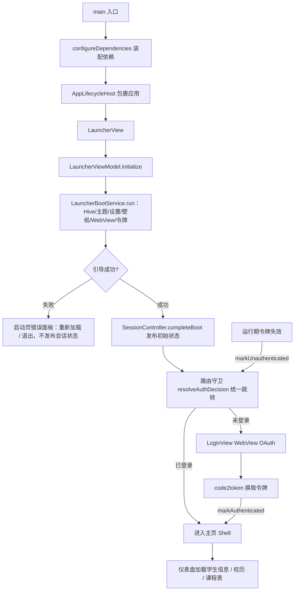

## 应用启动流程

OneTJ 的启动流程采用 **Launcher → Login / Home** 的设计模式。

### 流程图


```mermaid
graph TD
    A[main 入口] --> B[configureDependencies 装配依赖]
    B --> C[AppLifecycleHost 包裹应用]
    C --> D[LauncherView]
    D --> E[LauncherViewModel.initialize]
    E --> F[LauncherBootService.run：Hive/主题/设置/壁纸/WebView/令牌]
    F --> G{引导成功?}
    G -->|失败| G1[启动页错误面板：重新加载 / 退出，不发布会话状态]
    G -->|成功| H[SessionController.completeBoot 发布初始状态]
    H --> I[路由守卫 resolveAuthDecision 统一跳转]
    I -->|已登录| J[进入主页 Shell]
    I -->|未登录| K[LoginView WebView OAuth]
    K --> L[code2token 换取令牌]
    L -->|markAuthenticated| J
    J --> M[仪表盘加载学生信息 / 校历 / 课程表]
    N[运行期令牌失效] -->|markUnauthenticated| I
```

## Launcher 模块

### 职责

- 编排启动顺序：Hive 与日志 → 主题偏好 → 设置与启动壁纸（壁纸解析完成即回调先展示）→ WebView 环境与令牌校验（`LauncherBootService.run`，依赖经构造器注入）
- 决定会话初始状态并经 `SessionController.completeBoot` 发布，由路由守卫统一跳转
- 引导失败进入 `LauncherBootFailure` 状态，由视图展示错误并提供重试或退出
- 保证最短 1200ms 启动展示时间（引导与计时并行，不互相打断）

### 核心流程

```dart
class LauncherViewModel extends BaseViewModel<Never> {
  LauncherViewModel({
    required LauncherBootService bootService,
    required SessionController sessionController,
    this.minimumSplashDuration = const Duration(milliseconds: 1200),
  })  : _bootService = bootService,
        _sessionController = sessionController;

  Future<void> initialize() async {
    AppLoggingBootstrap.ensureInitialized();

    final Future<AuthStatus> statusFuture =
        _bootService.run(onWallpaperResolved: _updateWallpaper);
    final Future<void> delayFuture =
        Future<void>.delayed(minimumSplashDuration);

    final AuthStatus status;
    try {
      status = await statusFuture;
    } catch (error, stackTrace) {
      // 引导失败：记录 failure 并通知视图重试，不发布会话状态
      _failure = LauncherBootFailure(error: error, stackTrace: stackTrace);
      _isInitializing = false;
      notifyListeners();
      return;
    }
    await delayFuture;

    // 发布状态后守卫立即重新求值并离开启动页
    _sessionController.completeBoot(status);
  }
}
```

### 会话与守卫

- `SessionController`（`lib/app/session/session_controller.dart`）是登录态唯一真相源：`unknown`（引导中）/ `authenticated` / `unauthenticated`，同时作为 `GoRouter.refreshListenable`，状态变化即触发守卫重算
- `resolveAuthDecision`（`lib/app/router/auth_guard.dart`）是纯函数：`unknown` 一律放行；已登录停在启动页/登录页则去待回跳位置或首页；未登录除登录页外一律去登录页并记住回跳位置（启动页本身不记，避免回跳循环）
- 登录成功调 `markAuthenticated`，主动登出调 `markSignedOut`，运行期令牌失效（缺失、刷新过期、服务端拒绝/401）调 `markUnauthenticated(reason: ...)`，用户无论停在哪一层都会被整体替换到登录页

## Login 模块

### 职责

- 展示 WebView 进行 OAuth2 认证
- 捕获重定向 URL 中的授权码
- 校验 `state` 与 `error`，交换授权码获取令牌
- 保存令牌到本地

### OAuth2 流程

```
用户              LoginView              同济 Keycloak
 │                    │                        │
 │  打开登录页         │                        │
 │───────────────────>│                        │
 │                    │  buildAuthUri（含 state、kc_idp_hint）│
 │                    │───────────────────────>│
 │                    │  返回授权页面           │
 │  输入凭据           │<───────────────────────│
 │───────────────────>│                        │
 │                    │  重定向到 redirect_uri  │
 │                    │<───────────────────────│
 │  exchangeCodeIfRedirect 校验 state/code     │
 │                    │  code2token 交换        │
 │                    │───────────────────────>│
 │                    │  返回令牌               │
 │  跳转到主页         │                        │
 │<───────────────────│                        │
```

### 授权 URI 构建

```dart
Uri buildAuthUri() {
  return Uri.https(_baseUrl, _path, {
    'response_type': 'code',
    'client_id': _clientId,
    'redirect_uri': _redirectUri,
    'scope': _scope,
    'state': _state,          // UUID v4，防 CSRF
    'kc_idp_hint': 'tjiam',
  });
}
```

### WebView 处理

```dart
Future<bool> exchangeCodeIfRedirect(WebUri uri) async {
  if (!uri.toString().startsWith(_redirectUri)) return false;

  // 授权服务器错误重定向（如 invalid_scope）
  final error = uri.queryParameters['error'];
  if (error != null && error.isNotEmpty) {
    throw AuthRedirectException(
      error: error,
      errorDescription: uri.queryParameters['error_description'],
    );
  }

  final code = uri.queryParameters['code'] ?? '';
  if (code.isEmpty) throw AuthRedirectException(error: 'missing_code');

  // state 不匹配视为潜在网络攻击
  final state = uri.queryParameters['state'] ?? '';
  if (state != _state) throw AuthStateMismatchException();

  await _auth.exchangeCode(code);
  return true;
}
```

## Home 模块

### 职责

- 通过 `StatefulShellRoute.indexedStack` 承载主页四个标签页
- 各标签页按需加载数据

### 一级页面

| 页面 | 路径 | 功能 |
|------|------|------|
| **仪表盘** | `/home/dashboard` | 学生信息、校历、即将上课、功能宫格 |
| **课程表** | `/home/timetable` | 按周次展示课程表 |
| **工具** | `/home/tools` | 物理实验、成绩、考试、四六级入口 |
| **设置** | `/home/settings` | 主题、布局、节次、开发者选项等 |

### Shell 外详情页

| 页面 | 路径 |
|------|------|
| **成绩** | `/home/grades` |
| **四六级成绩** | `/home/cet-score` |
| **考试安排** | `/home/student-exams` |
| **物理实验** | `/home/tools/physics-lab` 及其子路由 |
| **设置二级页** | `/home/settings/about`、`/home/settings/time-slots` 等 |

## 数据加载流程

以仪表盘为例，`DashboardViewModel.load()` 并行加载：

```dart
Future<void> load() async {
  _studentLoading = true;
  _calendarLoading = true;
  _timetableLoading = true;
  notifyListeners();

  unawaited(_checkUpdateInBackground());
  try {
    await Future.wait([
      loadSettings(),
      loadStudentInfo(),
      loadSchoolCalendar(),
      loadCourseSchedule(),
      _uploadUserCollectionWhenStudentInfoLoaded(),
    ]);
  } finally {
    _scheduleUpcomingRefresh();
  }
}
```

数据获取通过 Application Service 协调 Repository 缓存与 API（依赖经构造器注入）：

```dart
class DashboardDataService {
  DashboardDataService({
    required TongjiApi api,
    // ... 其余依赖同样经构造器注入
    required SchoolCalendarRepository schoolCalendarRepository,
    // ...
  })  : _api = api,
        _schoolCalendarRepository = schoolCalendarRepository;
        // ...

  Future<SchoolCalendarData> getSchoolCalendar() async {
    await _schoolCalendarRepository.warmUp(); // 先加载本地缓存
    return _schoolCalendarRepository.getOrFetch(
      now: DateTime.now(),
      fetcher: _api.fetchSchoolCalendarCurrentTerm,
    );
  }
}
```

## 令牌管理

### 令牌类型

| 令牌 | 用途 | 有效期 |
|------|------|--------|
| **Access Token** | 调用 API | 短期（约 1 小时） |
| **Refresh Token** | 刷新 Access Token | 长期（约 30 天） |

### 数据结构

`TokenData` 存储于 Hive（box `auth_token`），记录 `issuedAt` 与有效期，提供过期判断：

```dart
bool isAccessTokenExpired({Duration skew = Duration.zero}) {
  final expiresAt = issuedAt.add(Duration(seconds: accessTokenExpiresIn));
  return DateTime.now().add(skew).isAfter(expiresAt);
}
```

### 自动刷新

由 `AuthTokenProvider.getValidAccessToken()` 统一处理：

```dart
Future<String> getValidAccessToken() async {
  final token = await _repository.getToken(refreshFromStorage: true);
  if (token == null) throw AppException('AUTH_REQUIRED', 'Missing access token');

  if (!token.isAccessTokenExpired(skew: _tokenSkew)) {
    return token.accessToken;
  }
  if (token.isRefreshTokenExpired(skew: _tokenSkew)) {
    throw AppException('AUTH_EXPIRED', 'Refresh token expired');
  }

  final refreshed = await _refreshToken(token.refreshToken);
  await _repository.saveFromCode2Token(refreshed);
  return refreshed.accessToken;
}
```

其中 `_tokenSkew` 为 30 秒的时钟偏移缓冲。

## 应用更新流程

1. 应用启动时 `AppLifecycleHost` 监听生命周期
2. 仪表盘加载时后台检查更新（`AppUpdateService.checkForUpdate(force: false)`）
3. 有更新时发出 `AppUpdateAvailableEvent`，由 `AppUpdateFlowCoordinator` 展示更新弹窗
4. 支持跳过版本、下载安装、迁移；应用恢复前台时尝试恢复待安装更新

## 错误处理

### 异常体系

`lib/app/exception/app_exception.dart` 定义了统一的异常体系：

| 异常 | 错误码 | 说明 |
|------|--------|------|
| `AppException` | 自定义 | 基类，构造时记录日志 |
| `AuthStateMismatchException` | `AUTH_STATE_MISMATCH` | OAuth state 不匹配 |
| `AuthRedirectException` | `AUTH_REDIRECT_ERROR` | 授权服务器错误重定向 / 缺少 code |
| `NetworkException` | `NETWORK_ERROR` | 网络请求失败（含 statusCode / uri / body） |
| `JSONResolveException` | `JSON_RESOLVE_ERROR` | JSON 解析失败 |
| `SettingsValidationException` | `SETTINGS_VALIDATION_ERROR` | 设置校验失败 |
| `RepositoryClearingException` | `REPOSITORY_CLEARING` | 仓库清理期间访问 |

### 错误流程

```
API 调用
    ↓
失败 → 抛出 AppException 子类（并记录日志）
    ↓
ViewModel 捕获
    ↓
emit(ShowSnackBarEvent / AppUpdateFailedEvent ...)
    ↓
View 订阅事件流
    ↓
显示 SnackBar / 弹窗提示
```